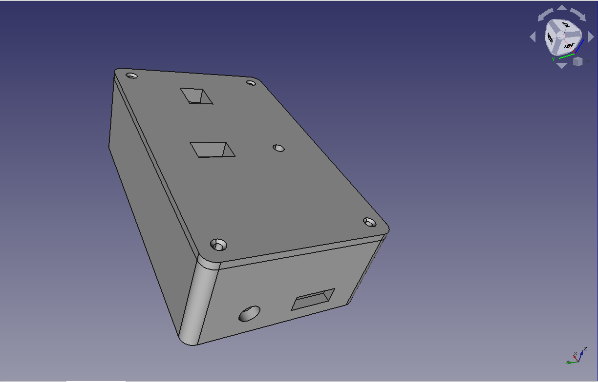
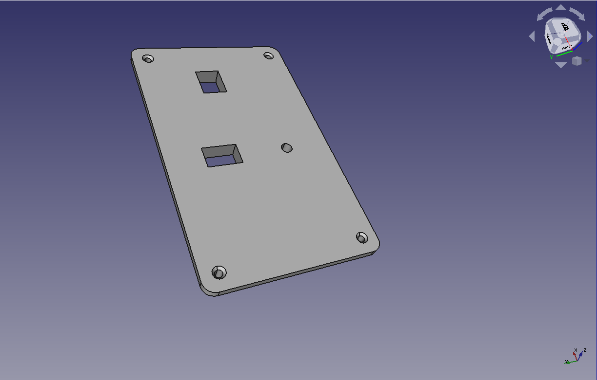
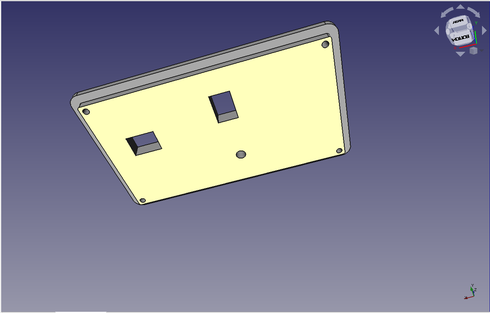
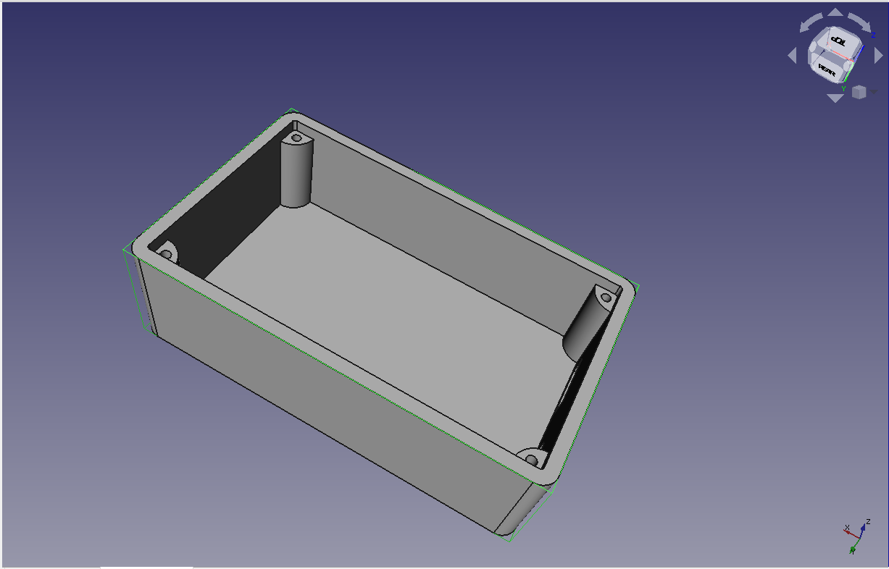
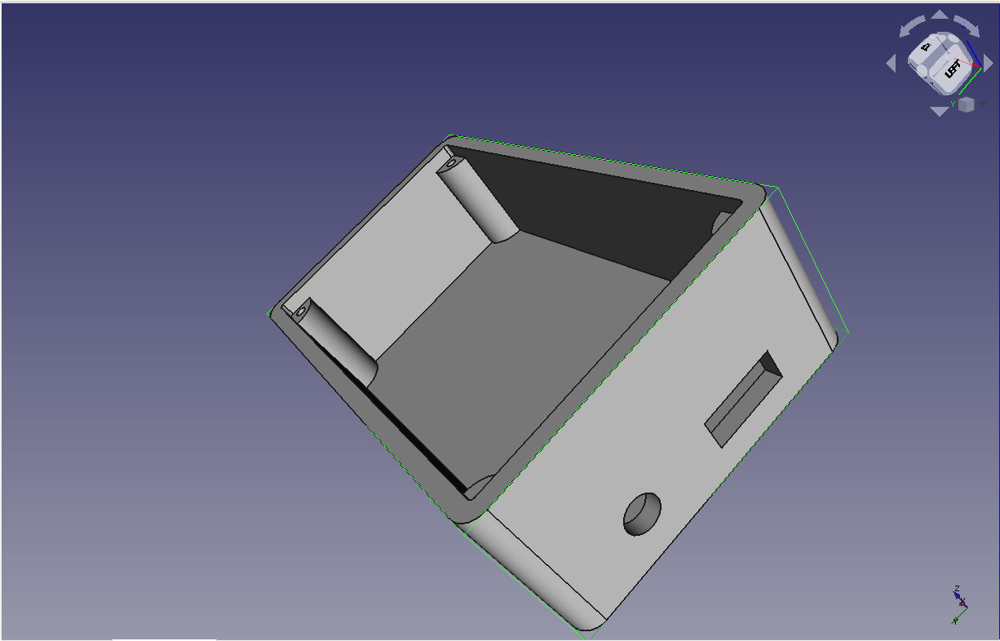
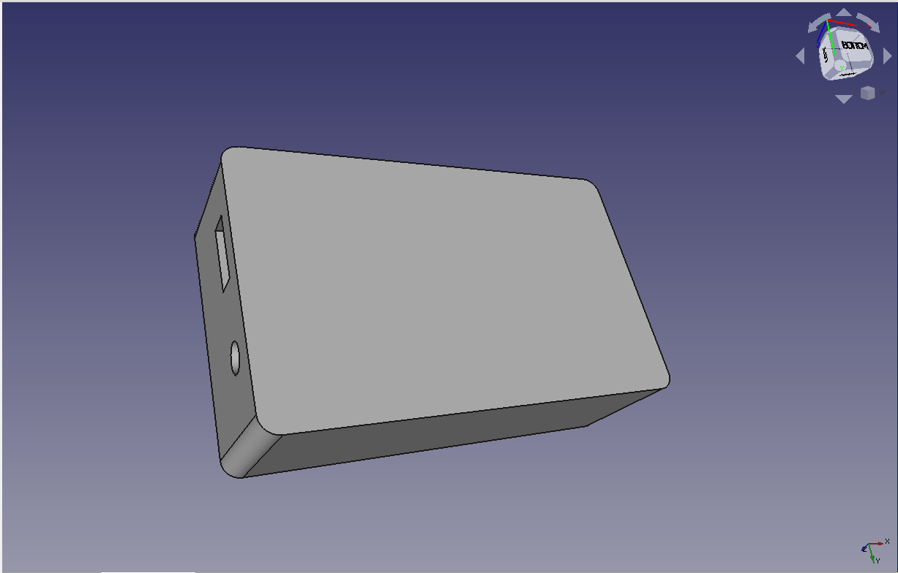

# temphumi-box

ตัวอย่างชิ้นงานที่ทำเสร็จ

ชิ้นส่วนฝา

บนชิ้นส่วนฝาก็จะมีการเจาะรูน็อตไว้4มุม และ 1.รูสี่เหลี่ยมบนสุดคือรูของtemp 2.รูสี่เหลี่ยมข้างล่างคือรูของpush switch 3.รูกลมเล็กคือรูของled

ต่อไปก็จะเป็นมุมล่างผมก็ทำการเพิ้มชั้นขึ้นมาเพื่อที่จะใส่กับชิ้นส่วนล่างได้

ต่อมาก็จะเป็นชิ้นส่วนกล่องข้างในผมก็ขึ้นตัวของรูน็อตให้ตรงกับชิ้นส่วนฝาเพื่อล็อคให้สนิท

ต่อมาในชิ้นส่วนกล่องผมก็ได้เจาะไว้มี 1.รูสี่เหลี่ยมสำไว้เชื่อมต่อกับrelay 2.รูวงกลมคือรูของตัว jack เสียบไฟเลี้ยง

รูปเพิ่มเติม

